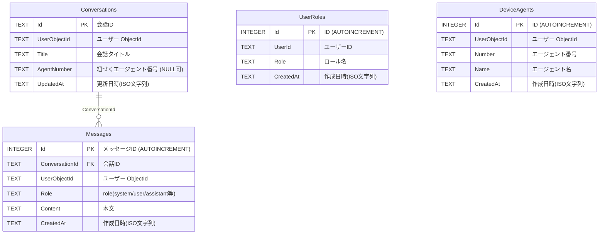

# データベーステーブル図

以下は SQLite 上で初期化される主要テーブルの構造とリレーションを示した図です。

## インデックスとキー
- `Conversations`: `PK(Id)`, `IX_Conversations_UserObjectId_UpdatedAt`, `IX_Conversations_UserObjectId_AgentNumber_UpdatedAt`
- `Messages`: `PK(Id)`, `FK(ConversationId -> Conversations.Id ON DELETE CASCADE)`, `IX_Messages_ConversationId`, `IX_Messages_UserObjectId_CreatedAt`
- `UserRoles`: `PK(Id)`, `UNIQUE(UserId, Role)` (`IX_UserRoles_UserId_Role`)
- `DeviceAgents`: `PK(Id)`, `UNIQUE(UserObjectId, Number)` (`IX_DeviceAgents_UserObjectId_Number`)

## 備考
- `Conversations.AgentNumber` はエージェント紐づけ用の任意列で、`DeviceAgents` とはユーザーごとの `(UserObjectId, Number)` で論理的に対応します（外部キー制約はなし）。
- いずれの日時も ISO 文字列として保存されます（SQLite の TEXT）。
