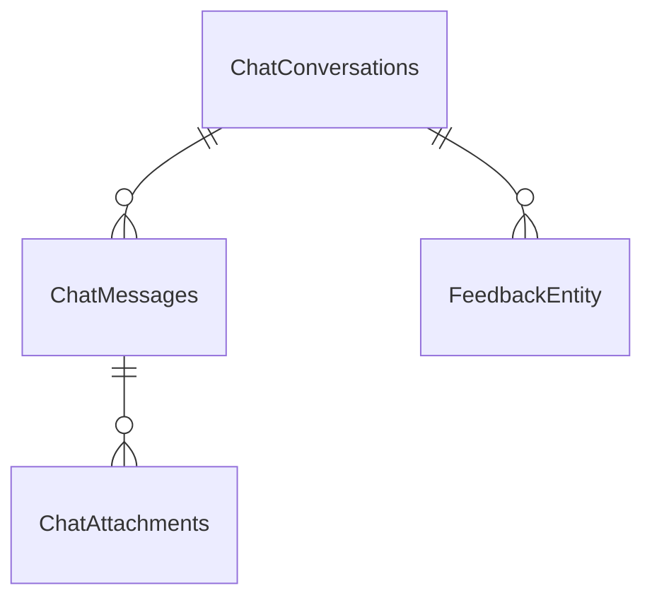

# データベーススキーマ

MOCHA は EF Core の `ChatDbContext` で上記のエンティティを管理し、PostgreSQL など任意の `ConnectionStrings:ChatDb` にマッピングされる。テーブルごとの主キー/制約・インデックスを OnModelCreating で定義し、チャット履歴／添付／図面／構成データを効率よく参照できるようにしている。

## ER 図（主要リレーション）

## 会話・メッセージ関連

- `ChatConversations`
  - 列: `Id`（PK, TEXT）、`UserObjectId`（TEXT）、`Title`（最大 200 文字）、`AgentNumber`（最大 100 文字, NULL 可）、`UpdatedAt`（DateTimeOffset）
  - 制約: `Messages` との 1 対多（on delete cascade）
  - インデックス: `(UserObjectId, UpdatedAt)`、`(UserObjectId, AgentNumber, UpdatedAt)`

- `ChatMessages`
  - 列: `Id`（PK, INTEGER 自動増分）、`ConversationId`（FK）、`UserObjectId`、`Role`（最大 50 文字）、`Content`（TEXT）、`CreatedAt`
  - 制約: `ChatConversations` との FK（削除時 cascade）
  - インデックス: `ConversationId`、`(UserObjectId, CreatedAt)`

- `ChatAttachments`
  - 列: `Id`（PK, TEXT）、`MessageId`（FK）、`ConversationId`、`UserObjectId`、`FileName`（最大 260 文字）、`ContentType`（最大 100 文字）、`Size`、`ThumbSmallBase64`、`ThumbMediumBase64`、`CreatedAt`
  - 制約: `ChatMessages` との FK（削除時 cascade）
  - インデックス: `MessageId`

- `FeedbackEntity`
  - 列: `Id`（PK）、`ConversationId`、`MessageIndex`、`UserObjectId`、`Rating`（最大 20 文字）、`Comment`（最大 1000 文字）、`CreatedAt`
  - 制約: `ConversationId` + `MessageIndex` + `UserObjectId` の複合一意制約
  - インデックス: `(UserObjectId, CreatedAt)`

## ロール・装置エージェント

- `UserRoles`
  - 列: `Id`（PK）、`UserId`、`Role`、`CreatedAt`
  - 制約: `(UserId, Role)` の UNIQUE（同じロールの重複防止）

- `DeviceAgents`
  - 列: `Id`（PK）、`UserObjectId`、`Number`、`Name`、`CreatedAt`
  - 制約: `(UserObjectId, Number)` の UNIQUE（ユーザーごとのエージェント番号は一意）

- `DeviceAgentPermissions`
  - 列: `Id`（PK）、`UserObjectId`、`AgentNumber`、`CreatedAt`
  - 制約: `(UserObjectId, AgentNumber)` の UNIQUE（利用許可の重複防止）

- `DevUserEntity`
  - 列: `Id`（PK）、`Email`（必須）、`DisplayName`、`PasswordHash`（必須）、`CreatedAt`
  - 制約: `Email` に UNIQUE（開発用ログインの一意性）

## 図面・構成情報

- `DrawingDocumentEntity`
  - 列: `Id`（PK, UUID）、`UserId`、`AgentNumber`、`FileName`、`ContentType`、`FileSize`、`Description`、`RelativePath`、`StorageRoot`、`CreatedAt`、`UpdatedAt`
  - インデックス: `(UserId, AgentNumber, CreatedAt)`（ユーザー＋エージェントで新しい順に検索）

- `PcSettingEntity`
  - 列: `Id`（PK, UUID）、`UserId`、`AgentNumber`、`Os`、`Role`、`RepositoryUrlsJson`（TEXT）、`CreatedAt`、`UpdatedAt`
  - インデックス: `(UserId, AgentNumber, CreatedAt)`

- `PlcUnitEntity`
  - 列: `Id`（PK, UUID）、`UserId`、`AgentNumber`、`Name`、`Manufacturer`、`Model`、`Role`、`IpAddress`、`Port`、`GatewayHost`、`GatewayPort`、`CommentFileJson`、`ProgramFilesJson`、`ModulesJson`、`FunctionBlocksJson`、`ProgramDescription`、`CreatedAt`、`UpdatedAt`
  - インデックス: `(UserId, AgentNumber, CreatedAt)`

- `GatewaySettingEntity`
  - 列: `Id`（PK, UUID）、`UserId`、`AgentNumber`、`Host`、`Port`、`UpdatedAt`
  - インデックス: `(UserId, AgentNumber)`

- `UnitConfigurationEntity`
  - 列: `Id`（PK, UUID）、`UserId`、`AgentNumber`、`Name`、`Description`、`DevicesJson`（TEXT）、`CreatedAt`、`UpdatedAt`
  - インデックス: `(UserId, AgentNumber, CreatedAt)`

## 運用上の補足

- 全テーブルで `UserId`/`UserObjectId` を軸にしたインデックスを張ることで、認証ユーザー単位のアクセスを高速化。
- `UpdatedAt`/`CreatedAt` による降順ソートを想定した複合インデックスを会話・図面・構成系で共通化。
- メッセージ・添付・フィードバックの削除は会話の cascade により連鎖し、履歴削除時の一貫性を維持。
